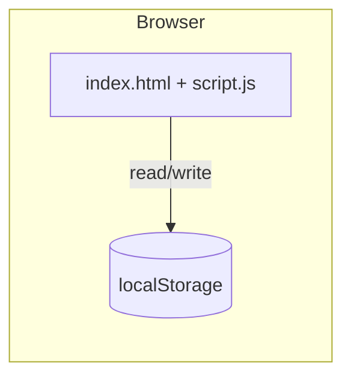
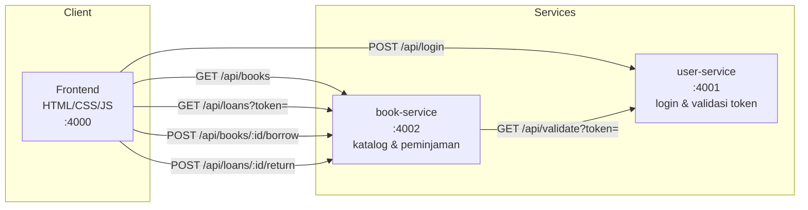
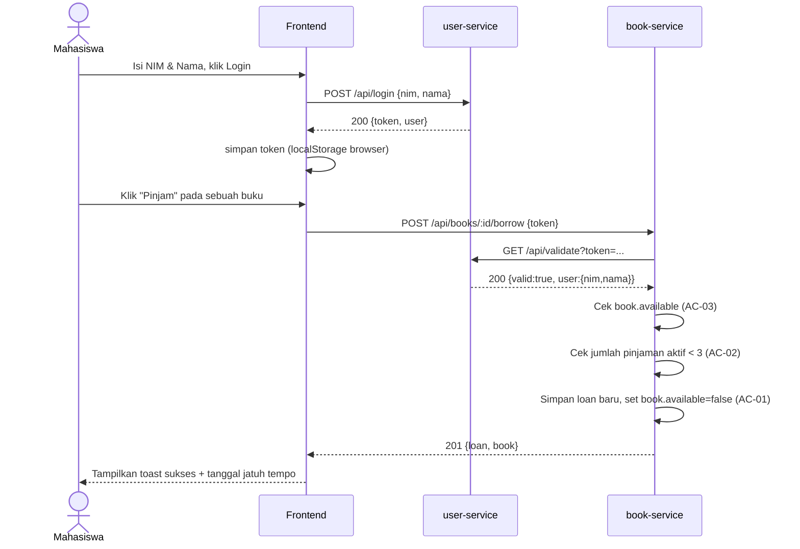

# Architecture — Sebelum & Sesudah

## 1. Arsitektur Sebelum (Praktikum Requirement Engineering)

Monolith satu halaman: seluruh logika (login, aturan bisnis, penyimpanan) berjalan di **browser**, tanpa server sama sekali.

**Karakteristik:**
- Tidak ada backend/server — semua logika ada di JavaScript sisi client.
- Data (buku, peminjaman, sesi login) tersimpan di `localStorage` browser, hanya berlaku untuk satu browser/perangkat.
- Aturan bisnis (AC-01/02/03) bisa "dilewati" siapa pun yang membuka DevTools dan mengubah `localStorage` langsung — tidak ada validasi di sisi server karena tidak ada server.

## 2. Arsitektur Sesudah (Microservice)

**Titik validasi token (setelah review ronde 2):** ketiga endpoint yang menyentuh
data milik mahasiswa — `GET /api/loans`, `POST /borrow`, dan `POST /return` — sama-sama
memanggil `user-service` lebih dulu. Satu-satunya endpoint publik adalah `GET /api/books`
(katalog memang boleh dilihat siapa pun). Pada versi sebelumnya hanya `borrow` yang
divalidasi; lihat [`AI_USAGE.md`](AI_USAGE.md) ronde 2.

**Karakteristik:**
- **user-service**: satu-satunya pemilik data identitas & sesi. Menerbitkan token saat login, dan satu-satunya pihak yang bisa memastikan "token ini benar-benar milik mahasiswa X."
- **book-service**: pemilik data buku & peminjaman. Menjalankan seluruh business rule (AC-01/02/03) di sisi server, sehingga tidak bisa dilewati dari client.
- **Komunikasi antar-service**: `book-service` memanggil endpoint `GET /api/validate` milik `user-service` melalui HTTP setiap kali ada permintaan pinjam buku — ini adalah titik komunikasi API-ke-API yang dipersyaratkan tugas.
- Setiap service punya tanggung jawab tunggal (*single responsibility*) dan dapat dikembangkan/dideploy secara independen.

## 3. Sequence Diagram — Alur "Meminjam Buku" (melibatkan kedua service)

Ini adalah alur fitur yang melibatkan kedua service sesuai ketentuan tugas ("minimal 1 alur fitur yang berjalan dengan melibatkan service yang dibuat").

Jika token tidak valid, atau salah satu aturan bisnis gagal, `book-service` merespons `401`/`409` **tanpa** mencatat peminjaman apa pun — diverifikasi pada pengujian di [`AI_USAGE.md`](AI_USAGE.md).

## 4. Pemetaan Requirement ke Service

| Requirement (studi kasus) | Service yang menangani |
|---|---|
| Mahasiswa harus login | `user-service` |
| Melihat daftar buku & ketersediaan | `book-service` |
| Meminjam buku tersedia | `book-service` (dengan verifikasi identitas ke `user-service`) |
| Maksimal 3 buku aktif | `book-service` |
| Larangan pinjam ganda | `book-service` |
| Masa pinjam 7 hari | `book-service` |
| Tampilkan info peminjaman | `book-service` (data) + Frontend (tampilan) |
| Mengembalikan buku | `book-service` (verifikasi token + cek kepemilikan ke `user-service`) |
| Privasi data peminjaman | `book-service` (NIM diambil dari token, bukan dari client) |
